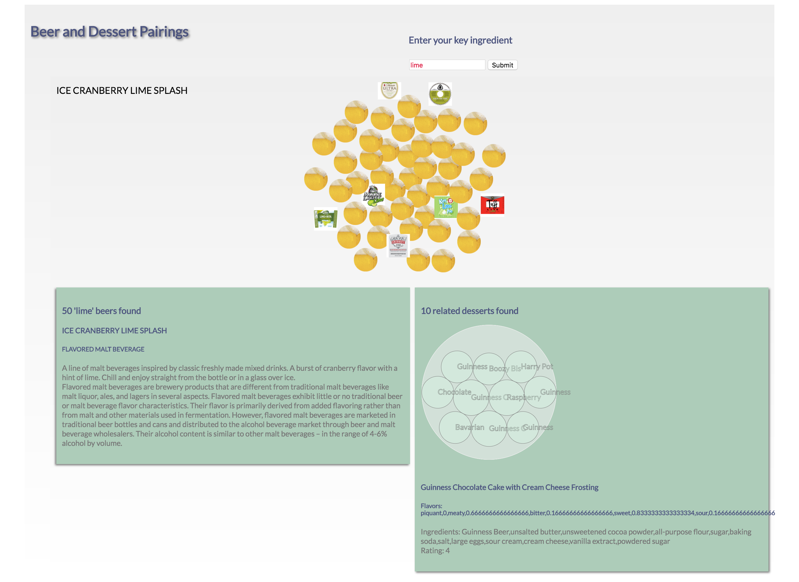

# FINALProjects
Project Requirements:
Create a single page (client-side only) web experience that ideally leverages data from at least one public web API and incorporates the use of at least one Javascript “interaction” library, such as p5, D3, Three, etc.

Cheklist:
Client-side web development.
At least one public web API as a data source
At least one javascript “interaction” library
Bonus: database storage

For my final project I continued to refine the BreweryDB - Yummly API call. 
Users enter a search word (top right of the page) that searches all BreweryDB data for beers containing the entered word.
Users can then click on the results, represented by their labels or default image of beer (center of the page) for more information about the beer.
Users can double click on the results  to look for related desserts that have similar ingredients. The ingredients are pulled from the beer and beer style description of the double-clicked on beer. This works by sending the beer and style descriptions to the textrazor api and searching for words related to food. the resulting entities are filtered by confidence and relevance score for the top 25% ranking scores. These ingredients are then sent through to the Yummly API.
Users can click on the dessert search results, represented by circles in the dessert information section at the bottom right hand of the page for more information on the dessert.

The challenges I faced were in designing a visual representation of the data and making the user interaction experience interesting but still usefull. Adding text made the page very wordy and busy very quickly so I had to strike a balance on how to display the text based on user interaction and some css styling.
I settled on using the D3 library for user interaction, as I as already familiar with it. I wanted to incorporate the circle pack layout, which I hadn't used before but had a lot of challenges getting th edata into the shape I needed. Initially, I settled on the force directed layout which had a nice simulation effect for the user to manuever through the beer search results. This ended up being better than my original circle pack idea, so I stuck with it for the final design. 
I did finaly figure out the data heirarchy needed for the pack layout and used it for the dessert results. 
Coding challenges:
data preparation - working with object heirarchies
managing missing data - lesson learned: data is always missing
images - adding images to svg and then styling them ended up being a major challenge. for the default images, i ended up styling the default in its raw formt and adding the styled default picture. 
textrazor call - the text analysis could use a lot more tinkering. namely filtering resulting entities against the yummly ingredient list for better dessert search results. As the Yummly call didn't support or searches, many searches were coming up null.
interaction - refining the interaction required quality time with the d3 wiki and some useful examples on bl.ocks.org.
I have to site: https://bl.ocks.org/mbostock/4063530 and http://bl.ocks.org/eesur/be2abfb3155a38be4de4 for their contribution to the final work.
